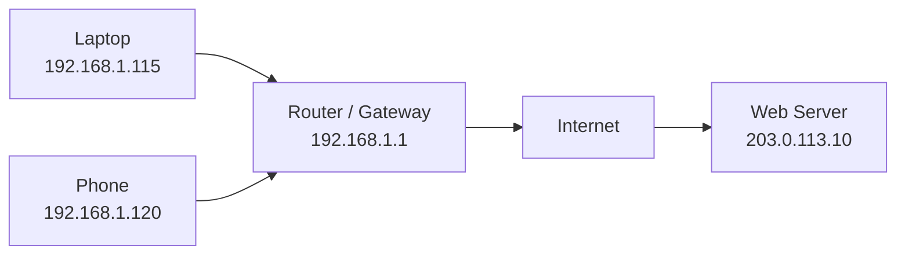

# IP Addressing Basics

## Purpose

This note explains IP addresses, subnet masks, default gateways, and communication between local and remote networks using three simple examples.

## Key Concepts

- An IP address identifies a network interface.
- A subnet mask separates the network portion from the host portion.
- Devices in the same subnet can communicate locally.
- Traffic for another network is sent to the default gateway.
- Private IPv4 addresses are not directly routable on the public Internet.
- NAT allows multiple private devices to share a public IP address.

## Example 1 — Home Network

| Item | Value |
|---|---|
| Network | `192.168.1.0/24` |
| Laptop | `192.168.1.115` |
| Phone | `192.168.1.120` |
| Gateway | `192.168.1.1` |
| Subnet mask | `255.255.255.0` |

The laptop and phone are in the same `/24` subnet. They can communicate locally without sending their traffic to another network.

Traffic intended for the Internet is sent to the default gateway at `192.168.1.1`.

## Example 2 — Office Network

| Item | Value |
|---|---|
| Network | `10.10.20.0/24` |
| Workstation | `10.10.20.25` |
| Server | `10.10.20.50` |
| Gateway | `10.10.20.1` |
| Subnet mask | `255.255.255.0` |

The workstation and server belong to the same local network.

Before sending an Ethernet frame, the workstation can use ARP to learn the server's MAC address.

If the workstation needs to reach another subnet, it sends the packet to its default gateway at `10.10.20.1`.

## Example 3 — Two Different Networks

| Device | IP address | Network |
|---|---|---|
| Client | `192.168.10.25/24` | `192.168.10.0/24` |
| Web server | `203.0.113.10/24` | `203.0.113.0/24` |
| Client gateway | `192.168.10.1` | Local router |

The client and web server are in different networks. Therefore, the client cannot send the packet directly to the web server.

The client sends the packet to its default gateway. Routers then forward the packet towards the destination network.

`203.0.113.0/24` is a documentation range used here only as an example.

## Simple Network Diagram



## Commands Used on macOS

### Show the local IPv4 address

```bash
ipconfig getifaddr en0
```

Example result:

```text
192.168.1.115
```

### Show the default gateway

```bash
route -n get default
```

Relevant example result:

```text
gateway: 192.168.1.1
interface: en0
```

### Show DNS configuration

```bash
scutil --dns
```

This command displays the DNS resolvers currently configured on the system.

### Test connectivity

```bash
ping -c 4 google.com
```

This command sends four ICMP Echo Request messages and reports response time and packet loss.

### Display the route to a destination

```bash
traceroute google.com
```

This command displays the router hops between the local device and the destination.

### Show the ARP table

```bash
arp -a
```

This command displays known IP-to-MAC address mappings on the local network.

## Evidence and Results

During my local test, I identified:

- A private IPv4 address in the `192.168.1.0/24` network
- `192.168.1.1` as the default gateway
- `en0` as the active network interface
- Successful Internet connectivity with no packet loss
- Multiple router hops between my device and Google

The ping test sent 10 packets and received 10 replies, resulting in `0%` packet loss.

The traceroute test reached Google at approximately the tenth hop. Some hops did not return an ICMP response, but the destination was still reached successfully.

These results demonstrate the difference between communication inside a local network and communication through a default gateway.

## What I Learned

- Devices use IP addresses for logical addressing.
- The subnet mask determines whether a destination is local or remote.
- Local devices use ARP to discover MAC addresses.
- Remote traffic is sent to the default gateway.
- Ping tests connectivity and round-trip time.
- Traceroute shows the router hops towards a destination.
- Missing traceroute responses do not always indicate a broken connection.

## Limitations

- IP addresses and routes can change when a device connects to another network.
- A successful ping does not prove that every service on the target is available.
- A failed ping does not always mean that the target is offline because ICMP may be blocked.
- Traceroute results can change because Internet traffic may use different routes.
- The addresses in this note are examples or sanitized lab values.
